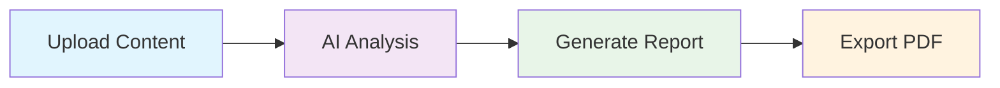

# GenX

<div align="center">

)

**Intelligent Document Analysis & Report Generation**

Transform your images and documents into comprehensive, professional reports powered by Google's Gemini AI

[](https://streamlit.io/)
[](https://www.python.org/downloads/)
[](https://opensource.org/licenses/MIT)
[](https://github.com/ArxvindhMagsi/GenX)

</div>

---

## Overview

GenX revolutionizes document analysis by combining cutting-edge AI technology with intuitive design. Upload any image or document, and watch as our intelligent system transforms it into detailed, professional reports in seconds.

### Key Capabilities

<table>
<tr>
<td width="50%">

**Smart Analysis**
- Advanced image recognition
- Context-aware content extraction
- Intelligent data interpretation
- Multi-format support

</td>
<td width="50%">

**Professional Output**
- Automated report generation
- Clean, structured formatting
- Export to PDF
- Customizable templates

</td>
</tr>
</table>

---

## Technology Stack

<div align="center">

| Frontend | AI Engine | Processing | Export |
|:--------:|:---------:|:----------:|:------:|
|  |  |  |  |

</div>

---

## Quick Start

### Prerequisites

```bash
# Check Python version
python --version  # Requires 3.8+

# Get your Google AI API key
# Visit: https://makersuite.google.com/app/apikey
```

### Installation

**1. Clone & Navigate**
```bash
git clone https://github.com/ArxvindhMagsi/GenX.git
cd GenX
```

**2. Install Dependencies**
```bash
pip install -r requirements.txt
```

**3. Configure Environment**
```bash
# Create .env file
echo "API_KEY=your_google_ai_api_key_here" > .env
```

**4. Launch Application**
```bash
streamlit run app.py
```

**5. Open Browser**
```
http://localhost:8501
```

---

## Usage Workflow

<div align="center">



</div>

1. **Upload** → Add your images or documents
2. **Analyze** → AI processes and understands content
3. **Generate** → Creates comprehensive reports
4. **Export** → Download professional PDF documents

---

## Project Architecture

```
GenX/
├── 📱 app.py                 # Main Streamlit application
├── 📋 requirements.txt       # Dependencies
├── 🔐 .env                   # Environment variables
├── 📝 README.md              # Documentation
├── 🚫 .gitignore             # Version control rules
└── ⚙️  .streamlit/           # App configuration
    └── config.toml
```

---

## Environment Configuration

| Variable | Description | Status |
|----------|-------------|--------|
| `API_KEY` | Google AI API Key | Required |

<details>
<summary><strong>How to get Google AI API Key</strong></summary>

1. Navigate to [Google AI Studio](https://makersuite.google.com/app/apikey)
2. Sign in with your Google account
3. Create a new API key
4. Copy and paste into your `.env` file

</details>

---

## Deployment Guide

<div align="center">

### Choose Your Platform

</div>

<table>
<tr>
<td width="50%">

**Render Deployment**

```bash
# Build Command
pip install -r requirements.txt

# Start Command  
streamlit run app.py --server.port $PORT --server.headless true
```

Set environment variable: `API_KEY`

</td>
<td width="50%">

**Vercel Deployment**

```json
// vercel.json
{
  "version": 2,
  "builds": [{"src": "app.py", "use": "@vercel/python"}],
  "routes": [{"src": "/(.*)", "dest": "app.py"}]
}
```

Add environment variable in dashboard

</td>
</tr>
</table>

---

## Performance & Features

<div align="center">

| Feature | Status | Performance |
|---------|--------|-------------|
| Image Analysis | ✅ Active | ~2-3 seconds |
| Report Generation | ✅ Active | ~1-2 seconds |
| PDF Export | ✅ Active | ~1 second |
| Multi-format Support | ✅ Active | Universal |

</div>

---

## Contributing

We welcome contributions! Here's how to get started:

<div align="center">

[](https://github.com/ArxvindhMagsi/GenX/graphs/contributors)

</div>

**Development Workflow:**
1. Fork the repository
2. Create feature branch: `git checkout -b feature/amazing-feature`
3. Commit changes: `git commit -m 'Add amazing feature'`
4. Push branch: `git push origin feature/amazing-feature`
5. Submit Pull Request

---

## Security & Best Practices

- Environment-based API key management
- Sensitive data excluded from version control
- Production-ready deployment configurations
- Regular dependency updates

---

## Support & Community

<div align="center">

| Need Help? | Get Involved |
|------------|--------------|
| [📖 Documentation](#) | [💬 Discussions](https://github.com/ArxvindhMagsi/GenX/discussions) |
| [🐛 Report Issues](https://github.com/ArxvindhMagsi/GenX/issues) | [⭐ Star Project](https://github.com/ArxvindhMagsi/GenX) |
| [💡 Feature Requests](https://github.com/ArxvindhMagsi/GenX/issues) | [🤝 Contribute](#contributing) |

</div>

---

## License & Acknowledgments

<div align="center">

**MIT License** • Built with ❤️ by [Aravindh Magsi](https://github.com/ArxvindhMagsi)

Special thanks to Google AI, Streamlit, and the open-source community

**[⭐ Star this repository](https://github.com/ArxvindhMagsi/GenX) if it helped you!**

</div>

---

<div align="center">
<sub>Made with passion for innovation • GenX © 2025</sub>
</div>
